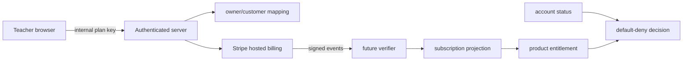

# Billing ownership and threat model

One authenticated teacher is the billing owner. One provider customer maps to one immutable `teacher_profiles.user_id` per Stripe environment. Database mapping, authenticated context, and verified provider object must agree; metadata only corroborates. No student, class, activity, roster, game, or performance data crosses this boundary.

| Threat | Control / fail-safe outcome |
| --- | --- |
| Forged owner/customer/subscription/price | Ignore browser IDs; server resolves owner and allowlisted price; composite FKs bind owner/customer/environment. |
| Forged URL or success redirect | Generate from validated origin/route; redirects grant nothing. |
| Replayed checkout | Future intent nonce plus provider idempotency; reject a known current subscription/checkout. |
| Duplicate customers/subscriptions | Unique mappings and one-current-subscription index; conflict goes to manual review without access. |
| Cross-account portal | Server lookup from authenticated owner; accept no customer ID. |
| Forged/replayed webhook | Raw-body signature, endpoint secret, tolerance, mode check, unique event ID. |
| Out-of-order/stale event | Compare event time, retrieve authoritative object, never regress newer projection. |
| Leaked test key/live accident | Server-only variables, scans, strict mode parser, production activation marker, rotation. |
| Email change | Immutable user ID retains ownership; email update is separate and verified. |
| Suspension/deletion | Deny premium; suspension denies management; deletion denies checkout and pauses deletion until billing resolves. |
| Checkout/webhook race | Show processing; only verified reconciliation can grant. |
| Provider outage | Keep a prior verified grant only to its stored period end; never create/extend. |

