# MathNexa Mobile Gameplay Fit V1

**Status: PRODUCTION LIVE — OWNER FINAL CHECK PENDING.** Owner staging PASS 2026-09-18; the exact certified runtime `c860a28` was promoted to `mathnexa.com` on 2026-09-19 00:33 UTC as `dpl_FNf6c8Zv8VsCefNW1EaLZ3uQiFoJ`, with `dpl_AaPnXGGohzFLd3ece7eNyah2xmCF` retained as rollback (§17). MAP Prep / ShowMe, billing, auth and the database are untouched. Not merged, not tagged.

Branch `feature/mobile-gameplay-fit-v1` off `origin/main` = `2e1e24f` (fetched 2026-09-18; the v1.2.10 release lineage).

| Commit | Kind | What |
| --- | --- | --- |
| `c860a28` | runtime | fit every game to a phone screen during play (CSS, the Math Vocabulary Hunt enhancer, the CrossCalc layout adapter, two document back-link spans) |
| `edbb229` | tests | mobile gameplay harness, layout audit, contract gate, real-play touch tests, axe, visual baselines |
| `0e40259` | tests | audit records survive between runs; per-game and matrix reports |
| `e5b3c0c` | docs | this record and its screenshots (staging) |
| (this commit) | docs | production record (§17) |

## 1. Owner problem

1. **Math Vocabulary Hunt (P0):** the letter grid is cut off on phones.
2. **CrossCalc (P0):** the learner has to scroll the page to move between the equation, the board and the number tiles.
3. Audit every other game (Number Cross, Number Logic) and fix only measured defects.

## 2. How it was measured

- **What a learner's browser receives, without the account stack.** `scripts/mobile-gameplay-harness.mjs` serves each game document exactly as production does: the shipped renderers (the Math Vocabulary Hunt enhancer applied read-only to the frozen `docs/index.html`; the CrossCalc, Number Cross and Number Logic document renderers), under the real route paths and the real route CSPs (pinned to the route code by `scripts/mobile-gameplay-harness.test.mjs`), plus the real public assets. Layout depends only on those, so sign-in and entitlement are not needed to measure it.
- **Baseline vs candidate.** The same harness file served `origin/main` from a separate clean worktree (`:4200`) and this branch (`:4196`).
- **Audit** (`e2e/mobile-gameplay/audit.spec.ts`, measurement only): every game driven through its normal UI into active gameplay, nothing scrolled, at 320×568, 360×640, 360×800, 375×667, 390×844, 393×852, 430×932, 768×1024, 844×390 (all engines) and 1440×900, 1920×1080 (desktop engines), in four Playwright projects: Chromium desktop, Chromium mobile (Pixel 7, touch), WebKit mobile (iPhone 13, touch), WebKit desktop. Recorded per viewport: document/body scroll extent and height, whether the game opened pre-scrolled, horizontal overflow, header height, board / problem / controls boxes, first and last board cell visibility (inside every clipping ancestor), anything covering them (hit-testing), and every internal scroller. Worst-case content: Math Vocabulary Hunt Grade 7 lesson 2-5 (18 × 18 grid, 9 terms); CrossCalc default Mixed · Medium; Number Cross default; Number Logic first mode.
- **Gate** (`e2e/mobile-gameplay/contract.spec.ts`): the contract below as assertions, real touch play, keyboard, axe, rotation, enlarged text and visual baselines (§12).

`npm run audit:mobile-gameplay` and `node scripts/report-mobile-gameplay-audit.mjs before after --game` / `after --matrix` reproduce every table in this record.

## 3. Root causes

### Math Vocabulary Hunt — why the grid was clipped

Below 900 px the canonical stylesheet turns the game into an ordinary scrolling page (`html, body { overflow: auto }`, `.game-screen { height: auto }`), stacks the header bar, a teacher bar that wraps into a 3 × 3 grid of nine controls, a stacked scoreboard and a separate timer banner (**351 px of header on every phone**), and gives the board a fixed `clamp(280px, min(94vw, 70dvh), 660px)` box. The canonical `fitGridToBoard()` then computes the cell size from that box but clamps it to `GRID_CELL_MIN = 24 px`. An 18-cell row at 24 px is 18 × 24 + gaps + padding ≈ **463 px**, wider than every phone (320–430 px), so the board panel switched to `grid-scroll-x/y`: the right-hand columns and bottom rows were clipped inside a board that itself started ~350 px down the page. The grid has `touch-action: none` (a drag selects letters), so the clipped cells could not even be reached by dragging the board. The word bank sat below the fold, and the canonical script focuses the first word card, so on most phones the game **opened already scrolled** (27–589 px) with its header off-screen. The fixed-position "Back to Games" overlay also covered the brand on every screen and the New Puzzle button on phones.

### CrossCalc — why scrolling was required

Every viewport, including the 1440 × 900 desktop and the 1920 × 1080 Smart Board, scrolled the page (130–460 px). A separate "Back to Games" row, a two-row toolbar and the status tiles pushed the board down; the board viewport was capped at `min(54vh, 430px)` on phones and `min(64vh, 680px)` elsewhere regardless of what sat above and below it, and the game layout claimed `min-height: calc(100vh - 76px)` (100vh is the *large* viewport in Safari, i.e. partly under the browser bars). Seven-column networks at 48 px cells overflowed sideways on most phones, and the sticky number tray sat on top of the board's lower cells (hit-testing found the board covered by the tray at 320–375 px). The active equation was only readable in the collapsed Equation Paths panel, so a learner scrolling to the tiles lost the problem they were solving.

### Number Cross

Already close: normal phones fitted. Short screens overflowed (320 × 568 scrolled 79 px and hid Hint / Undo / Redo / Restart; 360 × 640 and 375 × 667 scrolled 16–20 px), a phone in landscape showed a 200 px board with its lower rows and every tool below the fold (242 px of page scroll), and the tutorial's Skip button was painted underneath the demo board at every size (a pre-existing bug: it could not be clicked). The cell size came from the width alone.

### Number Logic

During play every viewport scrolled the page — 897–1 191 px on phones, 1 512 px in landscape, 471 px on the 1440 × 900 desktop and 291 px on the Smart Board — and Undo / Redo / Restart / Pause were never on screen: a separate Back row, the brand header, a large puzzle title and a two-line board heading pushed the board down, the tray followed it, and the controls lived at the end of the proof panel below everything.

## 4. Mobile contract (implemented and gated)

On normal phones (360 × 800, 375 × 667, 390 × 844, 393 × 852, 430 × 932) and on small phones (320 × 568, 360 × 640, 390 × 664 = iPhone 13 Safari with its bars showing), in Chromium and WebKit:

- the page itself never scrolls (document and body scroll extent ≤ 1 px) and never opens pre-scrolled;
- no horizontal page overflow;
- "Back to Games", the active problem / status, the whole board region and the essential controls are on screen at once, and hit-testing finds nothing covering the problem, the board, its first and last cells or the controls;
- at most ONE intentional internal region scrolls: the Math Vocabulary Hunt word bank, the CrossCalc board (plus its sideways tile tray), the Number Logic proof / hints panel (plus Product Square's grid and the sideways tray); Number Cross scrolls nothing;
- safe-area insets are respected (`env(safe-area-inset-*)` on every edge that touches the screen) and heights use `100dvh` with a `100vh` fallback, never `100vh` alone;
- touch targets keep 44 px (CrossCalc tiles and cells 44–48 px, Number Logic nodes never below 2.75 rem);
- the shells apply only during active play (Number Logic's library, tutorials, difficulty and results keep normal page scrolling; Math Vocabulary Hunt's grade, topic and lesson screens are unchanged);
- desktop, the 1920 × 1080 Smart Board, tablets and landscape phones meet the same no-page-scroll rule.

## 5. What changed, per game

Only platform-owned layers changed: the Math Vocabulary Hunt enhancer and stylesheet, the internal games' `integration.css`, the CrossCalc layout adapter (`runtime-layout.js`) and the "Back to Games" markup in two document renderers. The frozen canonical document, the released game bundles, the hash-pinned Number Cross engine and styles, all game data, storage keys and music are untouched (§10).

### Math Vocabulary Hunt

- **Header, before → after:** 351 px (breadcrumbs, 3 × 3 teacher bar, stacked scoreboard, timer banner) → **106 px**: one 51 px row `← Games · Grade 7 › Lesson 2-5 · ☰ Controls` plus one 55 px status row (Team 1 · Team 2 · timer). The timer stays visible; Back is a real link with the accessible name "Back to Games".
- **Teacher controls** (New Puzzle, Word Bank, Reveal Word, Timer, voice, music, Reset Scores, Fullscreen, Back to Lessons, Credits) moved into a **Controls** disclosure on phones: a real `<button aria-expanded aria-controls>`; it opens as a panel over the game, closes on Escape (focus returns to the button), on a press outside, and after an action; switches (Word Bank, Timer, sound) keep it open so their new state can be read. Without JavaScript nothing is hidden. Desktop and the Smart Board keep the full teacher bar; the credit became its last item; Back sits in the header flow and no longer covers the brand or New Puzzle.
- **Grid sizing:** the board is a square cut from **both** the available width and height through container queries; `--cell-size` is overridden (author `!important` beats the inline value the canonical script writes) as `(min(100cqw, 100cqh) − padding − border − gaps) / grid size`, with no 24 px floor; letters are 70 % of the cell, resolved once on the grid. 18 × 18 cells: 15.5 px at 320 × 568, 17.7 px at 360, 18.5 px at 375, **19.3 px at 390 × 844 (13.5 px bold capitals)**, 21.6 px at 430, 29.6 px on a 768 px tablet. Smaller grids get bigger cells. Every lesson grid size fits 390 × 844 with first and last cells on screen (contract test).
- **First / last cell:** visible at every measured viewport in both engines (before: last cell hidden on every phone).
- **Word bank:** two compact columns sized so every placeable term fits whole (no mid-word breaks, gated at 320/360/390/430); all 9 terms of the worst-case lesson visible at 390 × 844 without scrolling; on shorter phones the word bank is the one region that scrolls.
- **Touch:** real taps on a word whose letters run through the bottom rows found it; a real CDP touch drag across the last row selected letters and the page did not move.
- **Landscape phones:** board on the left at full height, status and word bank on the right.

### CrossCalc

- One fixed `100dvh` surface: **header** (← Games in the controls grid's first cell, the seven game controls; brand and Tiles / RI / Chain status on tall phones), **console** (Puzzle Setup and Equation Paths collapsed with live summaries — nothing removed — and a **"Solving" line** that shows the equation(s) through the selected cell, one chip per equation, blanks as "?"), **board**, **tray** (tiles, Hint, Check equations) docked at the bottom; hint feedback opens above the tray so nothing jumps under the thumb.
- **Problem visibility:** the Solving line reads the released app's own `li.active` equation rows (no game logic), updates live, and stays on screen while the board scrolls (gated). It is `aria-hidden` because each number cell already carries its equations in its accessible name.
- **Board:** the only region that scrolls, and only when a network is taller than the space. Operator tracks are half width (numbers always sit on odd grid lines, operators between — an invariant of the V2 generator), so a **7-column network fits a 320 px phone with 48 px tiles** and no sideways scrolling. On wide landscape screens the cell also fits the network's height: **a Medium network fits the 1440 × 900 desktop and the Smart Board whole** (before: a 576–680 px board frame and 185–264 px of page scroll).
- **Mobile scrolling result:** page scroll 0 at every viewport, both engines (before 130–460 px). On phones a Medium network scrolls vertically inside its own framed board (e.g. 528 px of network in a 369 px frame at 390 × 844) while the Solving line, the tray and Hint / Check stay put. Tiles and cells keep 44–48 px touch targets, so on phones networks of every difficulty are taller than the frame and scroll inside it (sampled 5 seeds per difficulty: Beginner fits whole from 430 × 932 and on tablets; Easy and Medium always scroll inside the frame on phones). The page never moves. A full Easy puzzle was solved on a phone by tapping cells and tiles only, ending in "Network complete.", with the page never scrolling.
- Expanded Setup / Paths panels scroll inside themselves; Escape closes them.

### Number Cross

Audit result: fitted 7 of 11 viewports already. Fixes, only for the measured failures:

- tutorial **Skip** is now a real, uncovered 44 px control above the demo board at every size (pre-existing bug);
- during play on phones a fixed `100dvh` column (compact header, status, board, tools) with the cell size from **both** width and height; 320 × 568 and 360 × 640 / 375 × 667 no longer scroll and keep Hint / Undo / Redo / Restart on screen;
- landscape phones: board on the left (cells 31.6 → 44.5 px), instruction, progress and tools on the right.

### Number Logic

Audit result: failed everywhere during play. Fixes:

- while a puzzle is played: one fixed `100dvh` surface — header (← Games · brand · sound · settings · Credits in one row), puzzle row (Exit · title · active time), board region (heading and target, the board as the largest square that fits width AND height, the number tray), **controls (Undo · Redo · Restart · Pause) pinned** above the live proof and hints, which scroll inside their own panel;
- settings open as a panel over the game instead of pushing it away;
- desktop and Smart Board: board panel and proof panel side by side at full height; landscape phones: board | heading, target and tray | controls and proof;
- every puzzle mode keeps target, board, tray and controls on a 390 × 844 phone (gated for all six modes);
- **automatic music behaviour unchanged**: no script, audio file or setting touched (CSS plus the Back link markup only); `test:number-logic:native` 7 / 7 covers the music contracts (one gesture-synchronous media backend, explicit retries, no drift in the audio sources). The authenticated music e2e cannot run locally (§13 item 1), so the owner test re-checks it on staging.

## 6. Before / After

Contract layout checks per game × viewport (both engines; phones, tablet and landscape on the touch profiles, 1440 / 1920 on the desktop profiles):

| Game | Viewports failing BEFORE | AFTER |
| --- | --- | --- |
| Math Vocabulary Hunt | 9 / 11 | 0 / 11 |
| CrossCalc | 11 / 11 | 0 / 11 |
| Number Cross | 4 / 11 | 0 / 11 |
| Number Logic | 11 / 11 | 0 / 11 |
| **All** | **35 / 44** | **0 / 44** |

### 6.1 Page scroll and board clipping (Chromium; WebKit agrees unless shown)

| GAME | VIEWPORT | PAGE SCROLL BEFORE | AFTER | BOARD CLIPPED BEFORE | AFTER |
|---|---|---|---|---|---|
| Math Vocabulary Hunt | 320×568 | YES 818 px | none | YES — clipped (sideways + below) | no — whole board visible |
| Math Vocabulary Hunt | 360×640 | YES 790 px | none | YES — clipped (sideways + below) | no — whole board visible |
| Math Vocabulary Hunt | 360×800 | YES 630 px | none | YES — clipped (sideways + below) | no — whole board visible |
| Math Vocabulary Hunt | 375×667 | YES 764 px | none | YES — clipped (sideways + below) | no — whole board visible |
| Math Vocabulary Hunt | 390×844 | YES 603 px | none | YES — clipped (sideways + below) | no — whole board visible |
| Math Vocabulary Hunt | 393×852 | YES 598 px | none | YES — clipped (sideways + below) | no — whole board visible |
| Math Vocabulary Hunt | 430×932 | YES 557 px | none | YES — clipped (sideways + below) | no — whole board visible |
| Math Vocabulary Hunt | 768×1024 | YES 559 px | none | YES — top rows off-screen (game opens pre-scrolled) | no — whole board visible |
| Math Vocabulary Hunt | 844×390 | YES 763 px | none | YES — last row below fold | no — whole board visible |
| Math Vocabulary Hunt | 1440×900 | none | none | no | no — whole board visible |
| Math Vocabulary Hunt | 1920×1080 | none | none | no | no — whole board visible |
| CrossCalc | 320×568 | YES 414 px (WebKit 410) | none | YES — clipped (sideways + below), covered by tray | no — board scrolls inside its own frame |
| CrossCalc | 360×640 | YES 407 px (WebKit 423) | none | YES — clipped (sideways + below), covered by tray | no — board scrolls inside its own frame |
| CrossCalc | 360×800 | YES 332 px (WebKit 347) | none | YES — clipped (sideways + below), covered by tray | no — board scrolls inside its own frame |
| CrossCalc | 375×667 | YES 326 px (WebKit 352) | none | YES — clipped (sideways + below), covered by tray | no — board scrolls inside its own frame |
| CrossCalc | 390×844 | YES 220 px (WebKit 228) | none | YES — clipped (sideways + below) | no — board scrolls inside its own frame |
| CrossCalc | 393×852 | YES 212 px (WebKit 220) | none | YES — clipped (sideways + below) | no — board scrolls inside its own frame |
| CrossCalc | 430×932 | YES 132 px (WebKit 130) | none | YES — last row below fold | no — board scrolls inside its own frame |
| CrossCalc | 768×1024 | YES 319 px (WebKit 311) | none | YES — last row below fold | no — board scrolls inside its own frame |
| CrossCalc | 844×390 | YES 414 px (WebKit 460) | none | YES — last row below fold | no — board scrolls inside its own frame |
| CrossCalc | 1440×900 | YES 264 px (WebKit 261) | none | YES — last row below fold | no — whole board visible |
| CrossCalc | 1920×1080 | YES 188 px (WebKit 185) | none | YES — last row below fold | no — whole board visible |
| Number Cross | 320×568 | YES 79 px | none | no | no — whole board visible |
| Number Cross | 360×640 | YES 20 px | none | no | no — whole board visible |
| Number Cross | 360×800 | none | none | no | no — whole board visible |
| Number Cross | 375×667 | YES 16 px | none | no | no — whole board visible |
| Number Cross | 390×844 | none | none | no | no — whole board visible |
| Number Cross | 393×852 | none | none | no | no — whole board visible |
| Number Cross | 430×932 | none | none | no | no — whole board visible |
| Number Cross | 768×1024 | none | none | no | no — whole board visible |
| Number Cross | 844×390 | YES 242 px | none | YES — last row below fold | no — whole board visible |
| Number Cross | 1440×900 | none | none | no | no — whole board visible |
| Number Cross | 1920×1080 | none | none | no | no — whole board visible |
| Number Logic | 320×568 | YES 1191 px | none | YES — last row below fold | no — whole board visible |
| Number Logic | 360×640 | YES 1137 px | none | YES — last row below fold | no — whole board visible |
| Number Logic | 360×800 | YES 977 px | none | no | no — whole board visible |
| Number Logic | 375×667 | YES 1125 px | none | YES — last row below fold | no — whole board visible |
| Number Logic | 390×844 | YES 945 px | none | no | no — whole board visible |
| Number Logic | 393×852 | YES 940 px | none | no | no — whole board visible |
| Number Logic | 430×932 | YES 897 px | none | no | no — whole board visible |
| Number Logic | 768×1024 | YES 875 px | none | no | no — whole board visible |
| Number Logic | 844×390 | YES 1512 px | none | YES — last row below fold | no — whole board visible |
| Number Logic | 1440×900 | YES 471 px | none | YES — last row below fold | no — whole board visible |
| Number Logic | 1920×1080 | YES 291 px | none | no | no — whole board visible |

### 6.2 Per game: page scroll height, viewport height, header height, board height, problem visibility (Chromium)

**Math Vocabulary Hunt**

| VIEWPORT | ENGINE | PAGE SCROLL HEIGHT before → after | VIEWPORT HEIGHT | HEADER HEIGHT before → after | BOARD HEIGHT before → after | CELL before → after | PROBLEM VISIBLE before → after | LAST BOARD CELL VISIBLE before → after |
|---|---|---|---|---|---|---|---|---|
| 320×568 | chromium-mobile | 1386 → 568 | 568 | 351 → 106 | 463 → 305 | 24 → 15.5 | NO → yes | NO → yes |
| 360×640 | chromium-mobile | 1430 → 640 | 640 | 351 → 106 | 463 → 345 | 24 → 17.7 | NO → yes | NO → yes |
| 360×800 | chromium-mobile | 1430 → 800 | 800 | 351 → 106 | 463 → 345 | 24 → 17.7 | yes → yes | NO → yes |
| 375×667 | chromium-mobile | 1431 → 667 | 667 | 351 → 106 | 463 → 360 | 24 → 18.5 | NO → yes | NO → yes |
| 390×844 | chromium-mobile | 1447 → 844 | 844 | 351 → 106 | 463 → 375 | 24 → 19.3 | yes → yes | NO → yes |
| 393×852 | chromium-mobile | 1450 → 852 | 852 | 351 → 106 | 463 → 378 | 24 → 19.5 | yes → yes | NO → yes |
| 430×932 | chromium-mobile | 1489 → 932 | 932 | 351 → 106 | 463 → 415 | 24 → 21.6 | yes → yes | NO → yes |
| 768×1024 | chromium-mobile | 1583 → 1024 | 1024 | 306 → 106 | 645 → 560 | 34 → 29.6 | NO → yes | yes → yes |
| 844×390 | chromium-mobile | 1153 → 390 | 390 | 256 → 107 | 463 → 325 | 24 → 16.6 | NO → yes | NO → yes |
| 1440×900 | chromium-desktop | 900 → 900 | 900 | 188 → 188 | 631 → 631 | 33 → 33 | yes → yes | yes → yes |
| 1920×1080 | chromium-desktop | 1080 → 1080 | 1080 | 188 → 188 | 835 → 835 | 44 → 44 | yes → yes | yes → yes |

**CrossCalc**

| VIEWPORT | ENGINE | PAGE SCROLL HEIGHT before → after | VIEWPORT HEIGHT | HEADER HEIGHT before → after | BOARD HEIGHT before → after | CELL before → after | PROBLEM VISIBLE before → after | LAST BOARD CELL VISIBLE before → after |
|---|---|---|---|---|---|---|---|---|
| 320×568 | chromium-mobile | 982 → 568 | 568 | 326 → 205 | 307 → 180 | 46 → 46 | yes → yes | NO → NO |
| 360×640 | chromium-mobile | 1047 → 640 | 640 | 333 → 205 | 346 → 231 | 48 → 48 | yes → yes | NO → NO |
| 360×800 | chromium-mobile | 1132 → 800 | 800 | 333 → 256 | 430 → 318 | 48 → 48 | yes → yes | NO → NO |
| 375×667 | chromium-mobile | 993 → 667 | 667 | 275 → 205 | 360 → 258 | 48 → 48 | yes → yes | NO → NO |
| 390×844 | chromium-mobile | 1064 → 844 | 844 | 276 → 249 | 430 → 369 | 48 → 48 | yes → yes | NO → NO |
| 393×852 | chromium-mobile | 1064 → 852 | 852 | 277 → 249 | 430 → 377 | 48 → 48 | yes → yes | NO → NO |
| 430×932 | chromium-mobile | 1064 → 932 | 932 | 277 → 249 | 430 → 457 | 48 → 48 | yes → yes | NO → NO |
| 768×1024 | chromium-mobile | 1343 → 1024 | 1024 | 301 → 279 | 655 → 517 | 50 → 50 | yes → yes | NO → NO |
| 844×390 | chromium-mobile | 804 → 390 | 390 | 174 → 104 | 242 → 271 | 48 → 44 | yes → yes | NO → NO |
| 1440×900 | chromium-desktop | 1164 → 900 | 900 | 186 → 153 | 576 → 731 | 66 → 63.5 | yes → yes | NO → yes |
| 1920×1080 | chromium-desktop | 1268 → 1080 | 1080 | 186 → 153 | 680 → 911 | 66 → 66 | yes → yes | NO → yes |

**Number Cross**

| VIEWPORT | ENGINE | PAGE SCROLL HEIGHT before → after | VIEWPORT HEIGHT | HEADER HEIGHT before → after | BOARD HEIGHT before → after | CELL before → after | PROBLEM VISIBLE before → after | LAST BOARD CELL VISIBLE before → after |
|---|---|---|---|---|---|---|---|---|
| 320×568 | chromium-mobile | 647 → 568 | 568 | 140 → 108 | 255 → 248 | 51.2 → 49.5 | yes → yes | yes → yes |
| 360×640 | chromium-mobile | 660 → 640 | 640 | 140 → 108 | 266 → 266 | 52.8 → 52.8 | yes → yes | yes → yes |
| 360×800 | chromium-mobile | 800 → 800 | 800 | 140 → 108 | 266 → 266 | 52.8 → 52.8 | yes → yes | yes → yes |
| 375×667 | chromium-mobile | 683 → 667 | 667 | 140 → 108 | 288 → 288 | 56.8 → 56.8 | yes → yes | yes → yes |
| 390×844 | chromium-mobile | 844 → 844 | 844 | 140 → 108 | 290 → 290 | 56.8 → 56.8 | yes → yes | yes → yes |
| 393×852 | chromium-mobile | 852 → 852 | 852 | 140 → 108 | 291 → 291 | 56.8 → 56.8 | yes → yes | yes → yes |
| 430×932 | chromium-mobile | 932 → 932 | 932 | 140 → 108 | 297 → 297 | 56.8 → 56.8 | yes → yes | yes → yes |
| 768×1024 | chromium-mobile | 1024 → 1024 | 1024 | 164 → 164 | 394 → 394 | 73.6 → 73.6 | yes → yes | yes → yes |
| 844×390 | chromium-mobile | 632 → 390 | 390 | 144 → 104 | 200 → 251 | 31.6 → 44.5 | NO → yes | NO → yes |
| 1440×900 | chromium-desktop | 900 → 900 | 900 | 164 → 164 | 407 → 407 | 72.8 → 72.8 | yes → yes | yes → yes |
| 1920×1080 | chromium-desktop | 1080 → 1080 | 1080 | 164 → 164 | 407 → 407 | 72.8 → 72.8 | yes → yes | yes → yes |

**Number Logic**

| VIEWPORT | ENGINE | PAGE SCROLL HEIGHT before → after | VIEWPORT HEIGHT | HEADER HEIGHT before → after | BOARD HEIGHT before → after | CELL before → after | PROBLEM VISIBLE before → after | LAST BOARD CELL VISIBLE before → after |
|---|---|---|---|---|---|---|---|---|
| 320×568 | chromium-mobile | 1759 → 568 | 568 | 253 → 122 | 279 → 219 | 52.8 → 44 | yes → yes | NO → yes |
| 360×640 | chromium-mobile | 1777 → 640 | 640 | 253 → 122 | 319 → 291 | 52.8 → 46.5 | yes → yes | NO → yes |
| 360×800 | chromium-mobile | 1777 → 800 | 800 | 253 → 122 | 319 → 324 | 52.8 → 51.8 | yes → yes | yes → yes |
| 375×667 | chromium-mobile | 1792 → 667 | 667 | 253 → 122 | 334 → 318 | 52.8 → 50.8 | yes → yes | NO → yes |
| 390×844 | chromium-mobile | 1789 → 844 | 844 | 253 → 122 | 349 → 354 | 52.8 → 56.6 | yes → yes | yes → yes |
| 393×852 | chromium-mobile | 1792 → 852 | 852 | 253 → 122 | 352 → 357 | 52.8 → 57.1 | yes → yes | yes → yes |
| 430×932 | chromium-mobile | 1829 → 932 | 932 | 253 → 122 | 389 → 394 | 52.8 → 63 | yes → yes | yes → yes |
| 768×1024 | chromium-mobile | 1899 → 1024 | 1024 | 357 → 217 | 544 → 524 | 69.1 → 80 | yes → yes | yes → yes |
| 844×390 | chromium-mobile | 1902 → 390 | 390 | 361 → 101 | 544 → 255 | 76 → 44 | NO → yes | NO → yes |
| 1440×900 | chromium-desktop | 1371 → 900 | 900 | 384 → 217 | 544 → 515 | 80 → 80 | yes → yes | NO → yes |
| 1920×1080 | chromium-desktop | 1371 → 1080 | 1080 | 384 → 217 | 544 → 695 | 80 → 80 | yes → yes | yes → yes |

Header height = the union of Back, the game's header bars and its status row, i.e. everything above the board. CrossCalc's "last board cell visible = NO" on phones is the intended framed board scroller (the frame itself is fully on screen and nothing covers it).

## 7. Viewport matrix (after, audit + contract)

| GAME | VIEWPORT | CHROMIUM | WEBKIT | OVERFLOW | PLAYABLE |
|---|---|---|---|---|---|
| Math Vocabulary Hunt | 320×568 | pass | pass | none | YES |
| Math Vocabulary Hunt | 360×640 | pass | pass | none | YES |
| Math Vocabulary Hunt | 360×800 | pass | pass | none | YES |
| Math Vocabulary Hunt | 375×667 | pass | pass | none | YES |
| Math Vocabulary Hunt | 390×844 | pass | pass | none | YES |
| Math Vocabulary Hunt | 393×852 | pass | pass | none | YES |
| Math Vocabulary Hunt | 430×932 | pass | pass | none | YES |
| Math Vocabulary Hunt | 768×1024 | pass | pass | none | YES |
| Math Vocabulary Hunt | 844×390 | pass | pass | none | YES |
| Math Vocabulary Hunt | 1440×900 | pass | pass | none | YES |
| Math Vocabulary Hunt | 1920×1080 | pass | pass | none | YES |
| CrossCalc | 320×568 | pass | pass | none | YES |
| CrossCalc | 360×640 | pass | pass | none | YES |
| CrossCalc | 360×800 | pass | pass | none | YES |
| CrossCalc | 375×667 | pass | pass | none | YES |
| CrossCalc | 390×844 | pass | pass | none | YES |
| CrossCalc | 393×852 | pass | pass | none | YES |
| CrossCalc | 430×932 | pass | pass | none | YES |
| CrossCalc | 768×1024 | pass | pass | none | YES |
| CrossCalc | 844×390 | pass | pass | none | YES |
| CrossCalc | 1440×900 | pass | pass | none | YES |
| CrossCalc | 1920×1080 | pass | pass | none | YES |
| Number Cross | 320×568 | pass | pass | none | YES |
| Number Cross | 360×640 | pass | pass | none | YES |
| Number Cross | 360×800 | pass | pass | none | YES |
| Number Cross | 375×667 | pass | pass | none | YES |
| Number Cross | 390×844 | pass | pass | none | YES |
| Number Cross | 393×852 | pass | pass | none | YES |
| Number Cross | 430×932 | pass | pass | none | YES |
| Number Cross | 768×1024 | pass | pass | none | YES |
| Number Cross | 844×390 | pass | pass | none | YES |
| Number Cross | 1440×900 | pass | pass | none | YES |
| Number Cross | 1920×1080 | pass | pass | none | YES |
| Number Logic | 320×568 | pass | pass | none | YES |
| Number Logic | 360×640 | pass | pass | none | YES |
| Number Logic | 360×800 | pass | pass | none | YES |
| Number Logic | 375×667 | pass | pass | none | YES |
| Number Logic | 390×844 | pass | pass | none | YES |
| Number Logic | 393×852 | pass | pass | none | YES |
| Number Logic | 430×932 | pass | pass | none | YES |
| Number Logic | 768×1024 | pass | pass | none | YES |
| Number Logic | 844×390 | pass | pass | none | YES |
| Number Logic | 1440×900 | pass | pass | none | YES |
| Number Logic | 1920×1080 | pass | pass | none | YES |

"Playable" = the layout half of the contract: page scroll ≤ 1 px, not pre-scrolled, no sideways overflow, Back / problem / board / controls fully on screen and uncovered, only the intended internal scroller. The interaction half (real taps, drags, keyboard, axe) is the contract suite, §12.

## 8. Landscape, tablet, desktop, Smart Board

- **Landscape phones (844 × 390, 667 × 375):** all four games fit with no page scroll: Math Vocabulary Hunt board left / words right (325 px board, 16.6 px cells, before: page scrolled 763 px and the game opened pre-scrolled 555 px); CrossCalc board left / tray right (before 414–460 px of page scroll); Number Cross board left / tools right (before 242 px, tools off-screen); Number Logic board | tray | controls and proof (before 1 512 px).
- **Rotation** portrait → landscape → portrait → landscape recalculates without a reload for every game (gated), including CrossCalc's tray snapping (a stale 2 px snap offset that clipped the first tile after rotating was fixed with `scroll-padding-inline`).
- **Tablet 768 × 1024:** no page scroll for any game. CrossCalc's Medium network still scrolls ~55 px inside its board frame in tablet *portrait* (cells stay 50 px); in tablet landscape (1024 × 768, 1194 × 834) it fits whole (5 of 5 sampled puzzles each).
- **Desktop 1440 × 900 and Smart Board 1920 × 1080:** Math Vocabulary Hunt unchanged (it already fitted; the full teacher bar stays); CrossCalc now fits a Medium network whole with no page scroll; Number Cross unchanged; Number Logic board and proof side by side with no page scroll (before 471 / 291 px).
- **Safari browser bars:** 390 × 664 (iPhone 13 with bars) is in the small-phone gate; every shell uses `100dvh`.
- **Enlarged text (20 px root font):** each game stays on one screen (gated).

## 9. Accessibility

- axe-core WCAG 2.0/2.1 A + AA at 390 × 844 in all four Playwright projects: **0 new violations** in every game (contrast is gated in Chromium; Playwright's WebKit cannot run axe's contrast canvas). Number Cross has four **pre-existing** findings in its hash-pinned engine markup, identical on `origin/main`, listed explicitly in the test rather than suppressed wholesale: `aria-allowed-attr` and `aria-required-parent` on `button[data-index]`, `aria-required-children` on `.puzzle-grid`, and `color-contrast` on `.correct .target-value`.
- Keyboard: the first twelve Tab stops of every game are visible, on screen, and tabbing never scrolls the page (gated).
- Nothing is removed from assistive technology: visually compacted labels (brand text, eyebrows, tray titles, the CrossCalc status on short phones, the Number Logic settings label) use the sr-only pattern; disclosure buttons expose `aria-expanded` / `aria-controls`; the CrossCalc Paths summary stays a polite live region; Back links keep their names ("Back to Games", "Back to MathNexa Games").
- No information by position alone: the Solving line repeats text the cells already announce; chips separate multiple equations (a "·" separator would read as multiplication).
- Forced-colors styles were added for the new Math Vocabulary Hunt controls; reduced-motion rules are untouched; focus rings are unchanged.
- Touch targets ≥ 44 px for every new or moved control.

## 10. Game logic

Unchanged. The branch touches no puzzle generator, solver, difficulty table, scoring, Reasoning Index, saved progress, storage key, completion rule, music track or question data: `docs/index.html` and `docs/vocab.js` are byte-identical to `origin/main`; `public/internal-games/*/assets` (the released CrossCalc V2 and Number Logic bundles), the Number Cross engine, `lib/games`, `app/`, `packages/` and `supabase/` have no diff. The CrossCalc adapter change only reads the released app's own `li.active` rows and adds a display line.

Regression results on this branch:

| Game | Evidence | Result |
| --- | --- | --- |
| CrossCalc V2 | `test:crosscalc:v2` — registry, route and the core suite that generates 2,500 puzzles across every mode and difficulty (unique solution, whole numbers, exact division, parity fixtures) | 20 / 20 |
| CrossCalc V2 | `test:crosscalc:v2:native` — result, storage, audio, palette and provenance contracts, the layout adapter (disclosures, equation line, credit, snapshot) | 7 / 9 (see §12 for the 2 environment-bound tests) |
| CrossCalc V1 rollback | `test:crosscalc:native` | 5 / 5 |
| CrossCalc | real play on a phone: an Easy network solved by tapping cells and tiles only, completion dialog "Network complete." | pass (Chromium + WebKit touch phones) |
| Number Cross | `test:number-cross` (registry, protected launch, route) + `test:number-cross:native` (hash-pinned engine and styles) + launch security audit | 24 / 24, 5 / 5, pass |
| Number Cross | real play: cross out tiles in the first and last rows, Undo | pass (Chromium + WebKit touch phones) |
| Number Logic | `test:number-logic` + `test:number-logic:native` + integration audit | 24 / 24, 7 / 7, pass |
| Number Logic | real play: place a tile from the tray, Undo; every mode keeps its target, board, tray and controls on screen | pass (touch phones; every-mode check in all 4 projects) |
| Math Vocabulary Hunt | canonical v7 e2e, real-runtime e2e, audio e2e, session e2e, audio version-atomic delivery, content audit (506 terms, 170 playable lessons, 0 unresolved references) | 9 / 9, 40 / 40, 8 / 8, 4 / 4, 3 / 3 + 9 / 9, pass |
| Math Vocabulary Hunt | real play: tap-to-find a word running through the bottom rows; a real touch drag across the last row | pass (taps: Chromium + WebKit touch; drag: Chromium, CDP touch events) |

## 11. Performance

No library added; CSS first; one small DOM helper in the existing CrossCalc adapter. Bytes over the wire (gzip), before → after:

| Game | File | gzip before → after |
| --- | --- | --- |
| Math Vocabulary Hunt | enhanced document | 25 887 → 26 341 B (+454) |
| Math Vocabulary Hunt | `canonical-runtime.css` | 1 338 → 5 096 B (+3 758) |
| CrossCalc | document | 594 → 624 B (+30) |
| CrossCalc | `integration.css` | 4 517 → 8 089 B (+3 572) |
| CrossCalc | `runtime-layout.js` | 1 974 → 2 858 B (+884) |
| Number Cross | `integration.css` | 1 699 → 3 577 B (+1 878) |
| Number Logic | document | 622 → 652 B (+30) |
| Number Logic | `integration.css` | 2 358 → 5 352 B (+2 994) |

Cold start to a playable board, Chromium phone profile (390 × 844, touch), medians of 7 alternating runs, before → after:

| Game (measured span) | normal CPU | 4× CPU throttle |
| --- | --- | --- |
| Math Vocabulary Hunt (lesson click → 324 cells) | 183 → **172 ms** | 807 → **778 ms** |
| CrossCalc (navigation → tiles) | 288 → 297 ms | 1 534 → 1 560 ms (+1.7 %) |
| Number Cross (Start → board) | 329 → 336 ms | 1 060 → 1 076 ms (+1.5 %) |
| Number Logic (difficulty → tray) | 89 → 90 ms | see below |

**Number Logic — one honest regression.** Document load is unchanged (DOMContentLoaded 690 → 660 ms at 4×), but the first board render after choosing a difficulty costs one heavier layout pass in the new fixed-height shell: in-page timing (click → board + tray painted) **33 → 49 ms at normal CPU (+16 ms, one frame)** and **232 → 322 ms at 4× throttle (+90 ms)**. A trace shows a single forced layout of the game view growing from ~155 to ~238 ms at 4×; bisection found no single rule responsible (removing the outer page shell or the inner game rules each recovers about half; containment, grid instead of flex, and removing `:has()` or container queries recover nothing), and hiding the brand header, puzzle header and tray together removes the difference — Blink lays those content-sized rows out twice inside the nested fixed-height columns. It is reported rather than hidden; the owner may accept it or ask for a follow-up that restructures the Number Logic shell.

Math Vocabulary Hunt is faster than before: the first version of its grid rules resolved a container-query calculation on each of the 324 cells (+45 ms at normal CPU, +430 ms at 4×); the letter size is now resolved once on the grid and inherited, which also beat the baseline. CrossCalc registers `--cell` as a `<length>` (`@property`) so each board resolves its container-relative size once.

## 12. Gates

Run on this branch (runtime `c860a28`; tests/tooling `edbb229`, `0e40259`), Windows, Node 24.18, Playwright 1.62, sequentially (no CPU contention).

| Gate | Result |
| --- | --- |
| `npm run typecheck` | pass |
| `npm run lint` | pass — 0 errors; 8 warnings, all in the untouched `public/game-suite/natural-voice.js` |
| platform-core unit | 245 / 245 |
| platform-web unit | 597 passed, 1 skipped; the only failure is `canonical-assets.test.ts` on the Windows CRLF working copy of the pinned `docs/index.html` — with the committed LF bytes on disk it passes 2 / 2 |
| CrossCalc V2 (incl. 2,500 generated puzzles) | 20 / 20 |
| CrossCalc V2 native | 7 / 9 — the two failures compare the shipped bundle and core against a standalone CrossCalc source checkout (`CROSSCALC_SOURCE_DIR` / `../../crosscalc`) that does not exist on this machine; the bundle and core are untouched by this branch |
| CrossCalc V1 native | 5 / 5 |
| Number Cross / native / launch security | 24 / 24, 5 / 5, pass |
| Number Logic / native / integration security | 24 / 24, 7 / 7, pass |
| Mobile gameplay harness (CSP parity with the route code) | 3 / 3 |
| Content audit | pass on the committed LF bytes (fails only on the CRLF working copy) |
| `npm run test:security` (baseline + platform bundle + Number Cross launch) | 279 / 279, bundle audit pass (30 client assets, 47 core files), launch audit pass |
| Game-suite media audit | pass on the committed LF bytes |
| MVH Pages redirect | 15 / 15 |
| MVH audio version-atomic (build check, 9 unit, 3 e2e) | pass |
| MVH real-runtime e2e | 40 / 40 |
| MVH audio e2e | 8 / 8 |
| MVH session e2e | 4 / 4 |
| Canonical v7 e2e | 9 / 9 |
| Production build (`npm run build`) | pass |
| **Mobile gameplay contract** (`npm run test:e2e:mobile-gameplay`: Chromium desktop, Chromium mobile touch, WebKit mobile touch, WebKit desktop; Smart Board 1920 × 1080 in the desktop projects) | **151 passed, 0 failed** (16.4 min); 41 skipped by design: the real-play tests run on the two touch projects (10 skipped on desktop), the CDP touch drag is Chromium-only (1), visual baselines are recorded on the Chromium touch project (30) |
| Mobile gameplay audit (`npm run audit:mobile-gameplay`) | 16 / 16 records, 44 / 44 game × viewport combinations playable in both engines |
| Authenticated internal-game e2e (`test:e2e:number-cross`, `test:e2e:number-logic`, `test:e2e:crosscalc:v2`) | every test in these suites fails locally (1, 2 and 2 tests) at the same assertion — **identically on untouched `origin/main`** (the app never mounts under `next dev`, §13 item 1) |
| `test:e2e:game-suite` | the Number Logic matrix test fails identically on untouched `origin/main` (same cause) |

The hash gates were re-run after re-materialising `docs/index.html`, `docs/vocab.js` and `vocab.js` from their committed blobs with LF line endings (`git diff origin/main -- <files>` is empty; the working copies differed only in CRLF). The staging deployment was uploaded from a pristine LF checkout, so it carries exactly the committed bytes.

## 13. Pre-existing findings (not caused or changed by this branch)

1. **Local `next dev` blocks the internal games' `<base href>`.** `next.config.mjs` applies the platform CSP (with `base-uri 'none'`, since `ec0cbf7`, 2026-08-30) to every path; Next's own server *appends* the game route's CSP (`base-uri 'self'`), the browser enforces both, and the internal game documents' `<base href>` is blocked, so their scripts resolve under `/games/<slug>/` and 404. Result: locally, `test:e2e:number-cross` (1 test), `test:e2e:number-logic` (2) and `test:e2e:crosscalc:v2` (2) fail because the app never mounts — **identically on untouched `origin/main` `2e1e24f`** (same tests, same lines). Hosted Vercel is believed unaffected: Vercel documents that function response headers override `next.config` headers, and production `/teacher` returns only the proxy's own CSP (no second policy). The mobile harness serves the route CSP exactly as production does, which is why it is used for this phase. Flagged as a separate follow-up; not changed here.
2. Number Cross axe findings in the hash-pinned engine markup (§9).
3. `lib/game-access/canonical-assets.test.ts` fails on Windows CRLF checkouts (sha256 of `docs/index.html` read with CRLF); passes on LF checkouts; `docs/index.html` is unchanged by this branch.
4. Math Vocabulary Hunt before this branch opened pre-scrolled on phones (the canonical script focuses the first word card); the shell now keeps the page at 0 (the focus still lands on the card).

## 14. Staging and owner test

| Item | Value |
| --- | --- |
| Project | `mathnexa-platform-staging` (`prj_O61Cyx9WMjc0jljpM9erCiSXsJA0`, team bright-path-ed-tech) — staging only |
| Previous staging deployment (rollback) | `dpl_97nafmJZerzsc13FYAPA4X6tA1oS` (the Git-connected build of main `2e1e24f`, 2026-09-17 22:38 CDT) |
| **New staging deployment** | **`dpl_ApV1224N1gknHqn6xPVofs5MS3PF`** = `https://mathnexa-platform-staging.vercel.app`, **Ready** (build 1 m 38 s), created 2026-09-18 03:49:33 CDT |
| Runtime commit | `c860a288e36177366d3ffa9c207387aa917c1417` (tree `89f9fa358e151360475fc437c688739c2161cede`), uploaded from a pristine LF checkout of that commit; deployment-scoped `MVH_SOURCE_REVISION` = `c860a28…` (what `/api/health` reports as `build`); no project environment variable was created or changed. The later branch commits change tests, tooling and docs only (`apps/`, `packages/`, `supabase/`, the canonical documents and the lockfile are identical to `c860a28`). |
| Command | `vercel deploy . --project mathnexa-platform-staging --prod --yes --env MVH_SOURCE_REVISION=c860a28… --meta candidateCommit=… --meta candidateTree=… --meta purpose=mobile-gameplay-fit-v1` (`--prod` here = the staging project's own alias) |
| Gate | locked: anonymous requests to the alias answer 404 with an empty body |
| Not checked by this session | gameplay through the gate — the session did not use the staging access credential or an entitled account; the owner test below covers it |
| Staging rollback | `vercel promote dpl_97nafmJZerzsc13FYAPA4X6tA1oS --scope bright-path-ed-tech` (staging project only) |

### Owner test (staging)

Open `https://mathnexa-platform-staging.vercel.app`, do the gate bootstrap step as usual, sign in with an entitled account, then on a **phone** (portrait, then landscape), a **desktop** and the **Smart Board**:

1. **Math Vocabulary Hunt** — `https://mathnexa-platform-staging.vercel.app/games` → Math Vocabulary Hunt → Play. Grade 7 → open the topic "Analyze and Use Proportional Relationships" → "Choose from … lessons" → "Graph Proportional Relationships" (the largest grid, 18 × 18).
   - Header is ONE row: `← Games`, `Grade 7 › Lesson 2-5`, `☰ Controls`; below it ONE status row: Team 1, Team 2, timer.
   - The whole grid is visible: top-left letter AND bottom-right letter, without scrolling anything.
   - Word bank below the grid shows the terms (all 9 on a normal phone).
   - Tap a term, then tap the first and last letters of a word in the bottom rows (or drag across them): the page must not move.
   - Tap `☰ Controls`: New Puzzle, Word Bank, Reveal Word, Timer, voice, music, Reset Scores, Fullscreen, Back to Lessons, Credits appear over the game; tap outside or press Escape to close.
   - Rotate to landscape: grid on the left, status and words on the right.
   - Desktop / Smart Board: looks as before, with Back no longer covering the logo.
2. **CrossCalc** — `https://mathnexa-platform-staging.vercel.app/games/crosscalc/play` (starts Mixed · Medium).
   - Top: `← Games` and the game controls; `Puzzle Setup` and `Equation Paths` collapsed; a `SOLVING` line.
   - Tap any empty `?` cell: its equation(s) appear in the Solving line; tap a tile to place it.
   - If the network is taller than the phone, scroll **the board itself**: the page stays still and the Solving line and tiles stay on screen.
   - On a phone the network is usually taller than the board frame at every difficulty (tiles stay 44–48 px); drag the board to see the lower equations — only the board moves.
   - Desktop / Smart Board: a Medium network fits whole, board left, tiles right, no page scrolling.
3. **Number Cross** — `https://mathnexa-platform-staging.vercel.app/games/number-cross/play` → Start. In the tutorial, `Skip` (top-right of the card) works. During play the board, the targets and Hint / Undo / Redo / Restart are all on screen without scrolling, on small phones and in landscape too (board left, tools right).
4. **Number Logic** — `https://mathnexa-platform-staging.vercel.app/games/number-logic/play` → choose a mode → Skip tutorial (if shown) → choose a difficulty. Board, target, number tray and Undo / Redo / Restart / Pause are on screen without scrolling; hints and the live proof scroll inside their own panel. Music behaves exactly as before.

Pass = no page scrolling in any game during play, nothing cut off, the active problem always visible.

## 15. Production, MAP Prep, main, tag

- Production (`mathnexa.com`): during staging review unchanged (`dpl_AaPnXGGohzFLd3ece7eNyah2xmCF`, runtime `80a509c`); after the owner's staging PASS the exact runtime was promoted — see §17 (`dpl_FNf6c8Zv8VsCefNW1EaLZ3uQiFoJ`).
- MAP Prep / ShowMe: **unchanged** — still `dpl_B7vcLDDoRpvZAm5UZgPCfhz6u9F9`.
- No billing, auth or database change.
- `main`: **not merged** (still `2e1e24f`). Tag: **none created** (next platform tag remains `v1.2.11`).

## 16. Screenshots

Captured from the harness (baseline `origin/main` vs this branch), Chromium phone profile at device scale 1, seeded puzzles, worst-case content (§2). Files in `docs/mobile-gameplay-fit-v1/`.

**Math Vocabulary Hunt — 390 × 844**

| Before (origin/main) | After (this branch) |
| --- | --- |
| 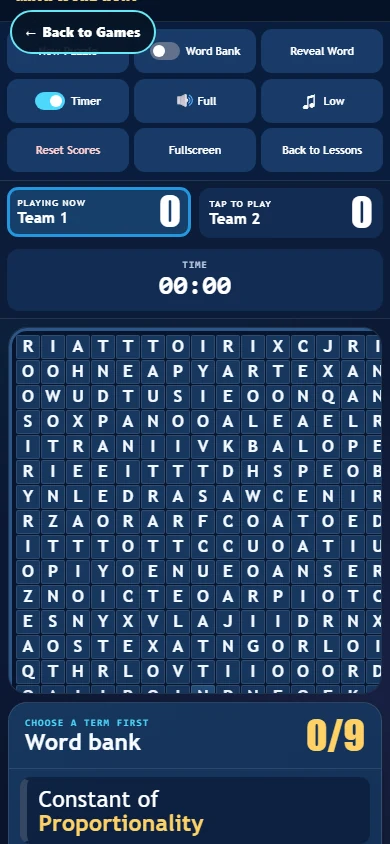 | 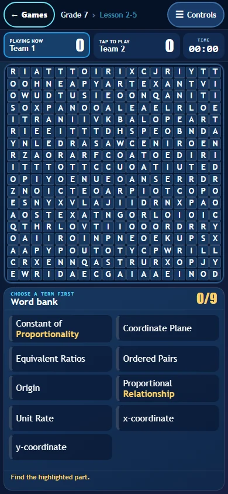 |

**Math Vocabulary Hunt — 320 × 568**

| Before (origin/main) | After (this branch) |
| --- | --- |
| 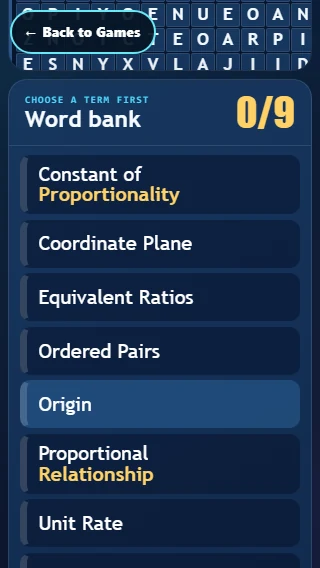 | 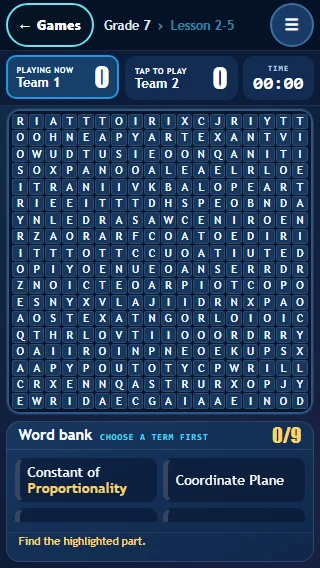 |

**Math Vocabulary Hunt — 844 × 390**

| Before (origin/main) | After (this branch) |
| --- | --- |
| 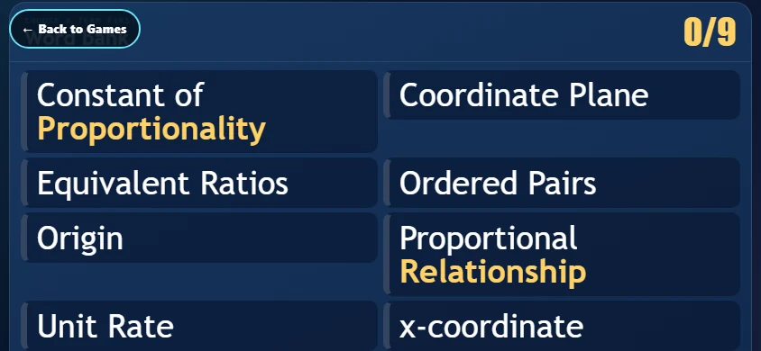 | 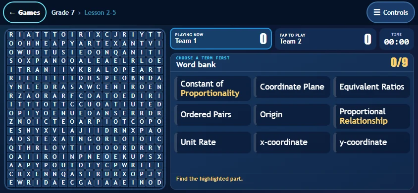 |

**Math Vocabulary Hunt — 1920 × 1080**

| Before (origin/main) | After (this branch) |
| --- | --- |
| 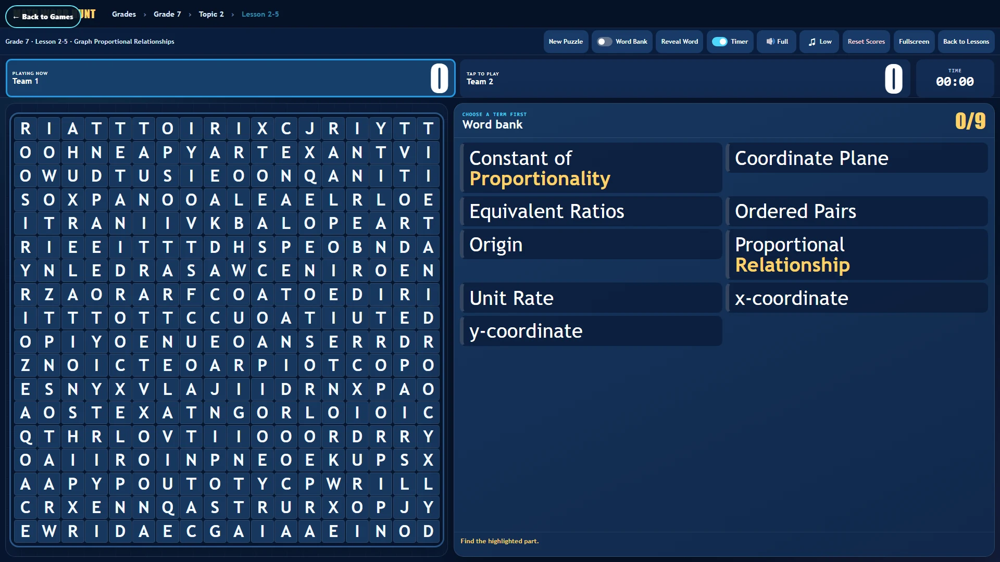 | 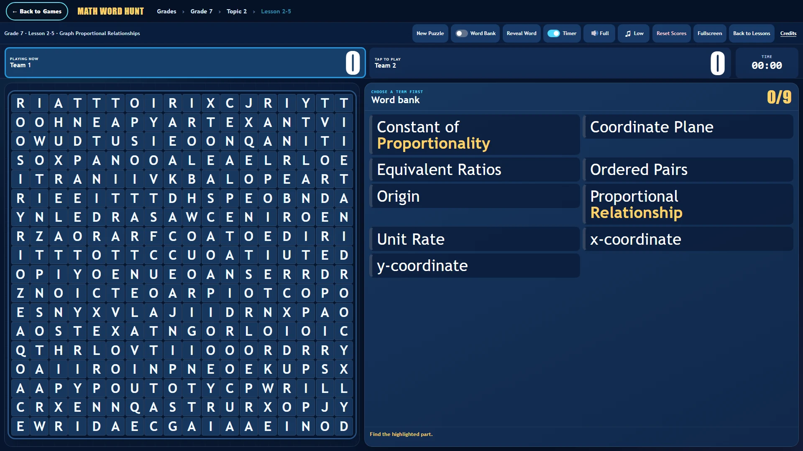 |

**CrossCalc — 390 × 844**

| Before (origin/main) | After (this branch) |
| --- | --- |
| 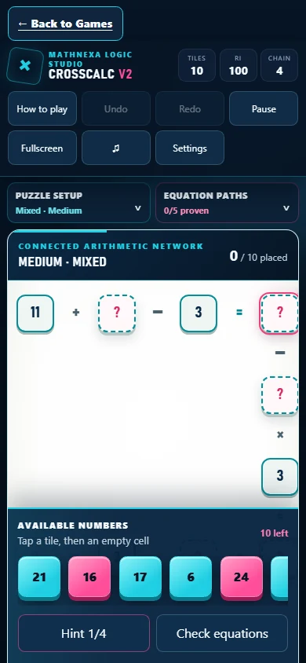 | 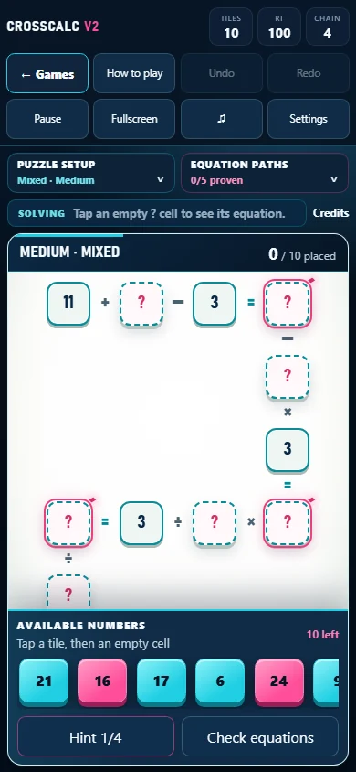 |

**CrossCalc — 320 × 568**

| Before (origin/main) | After (this branch) |
| --- | --- |
| 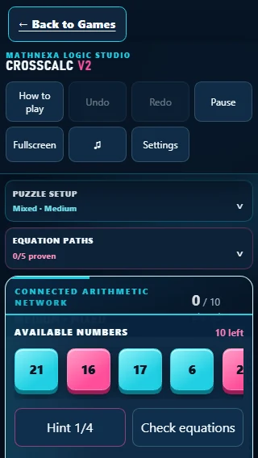 | 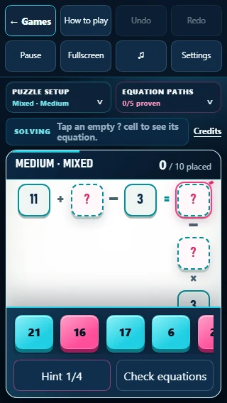 |

**CrossCalc — 844 × 390**

| Before (origin/main) | After (this branch) |
| --- | --- |
| 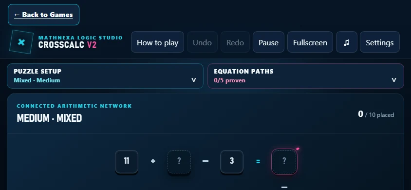 | 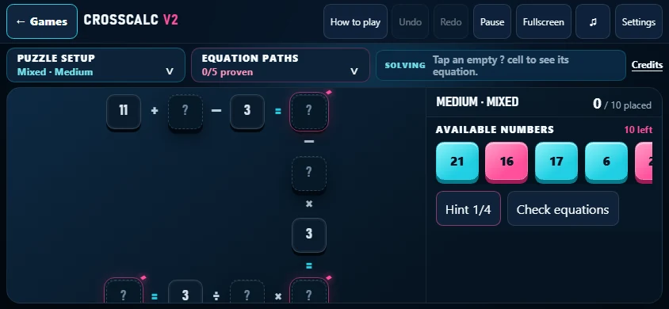 |

**CrossCalc — 1920 × 1080**

| Before (origin/main) | After (this branch) |
| --- | --- |
| 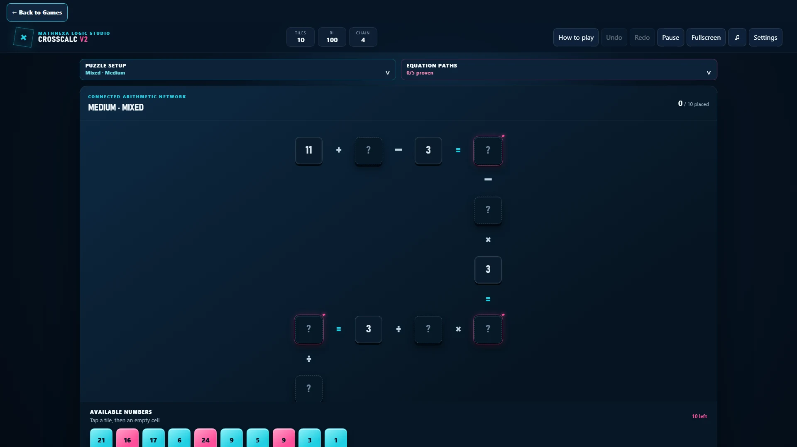 | 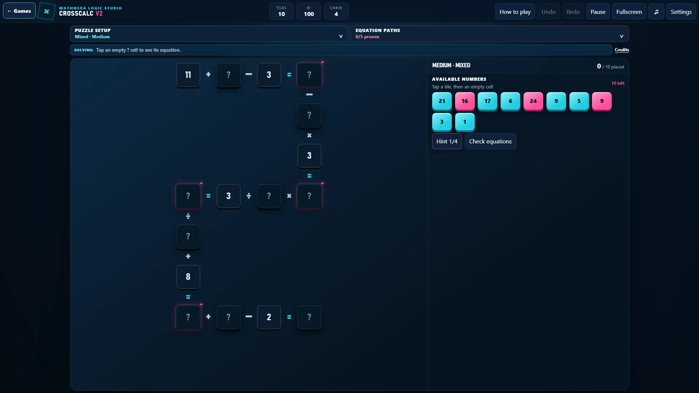 |

**Number Cross — 390 × 844**

| Before (origin/main) | After (this branch) |
| --- | --- |
| 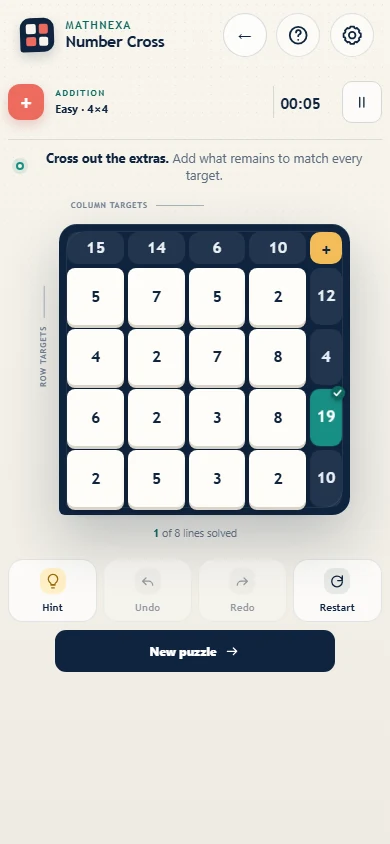 | 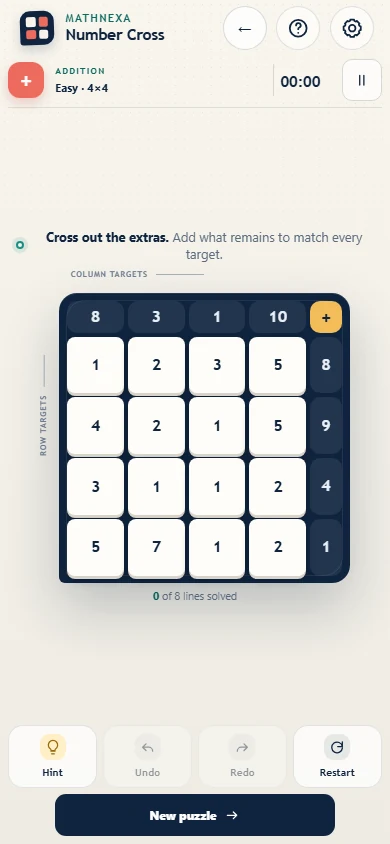 |

**Number Cross — 320 × 568**

| Before (origin/main) | After (this branch) |
| --- | --- |
| 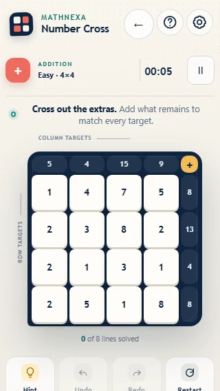 | 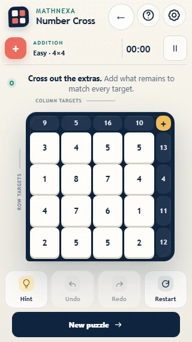 |

**Number Cross — 844 × 390**

| Before (origin/main) | After (this branch) |
| --- | --- |
| 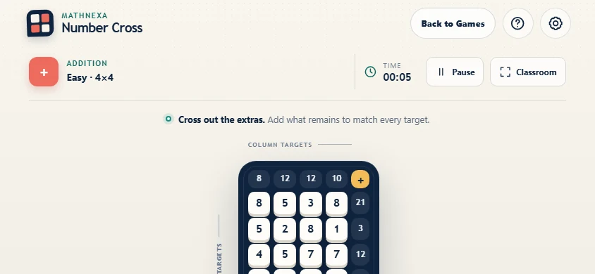 | 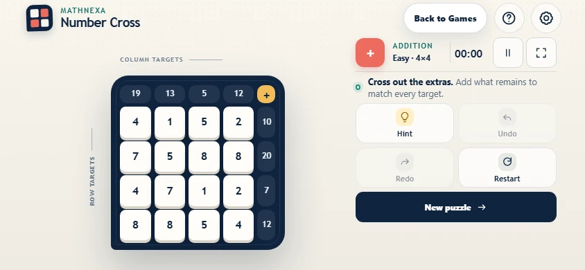 |

**Number Logic — 390 × 844**

| Before (origin/main) | After (this branch) |
| --- | --- |
| 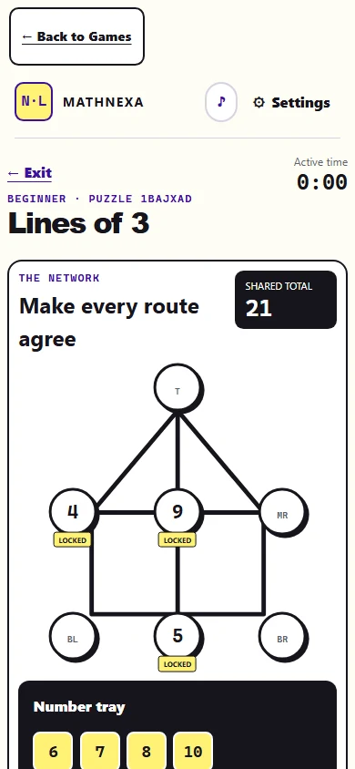 | 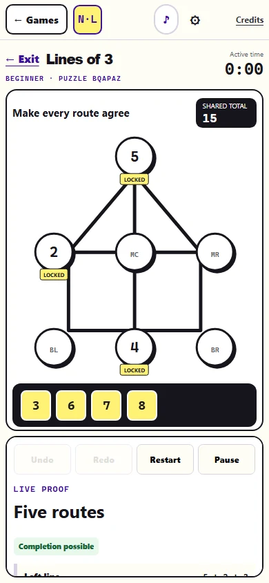 |

**Number Logic — 844 × 390**

| Before (origin/main) | After (this branch) |
| --- | --- |
| 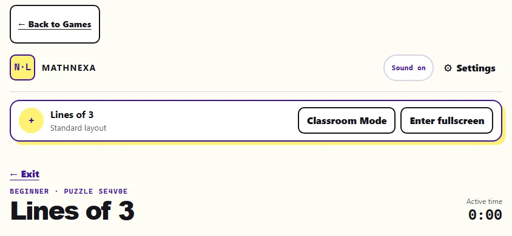 | 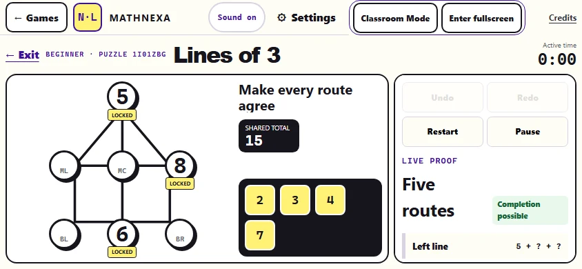 |

**Number Logic — 1920 × 1080**

| Before (origin/main) | After (this branch) |
| --- | --- |
| 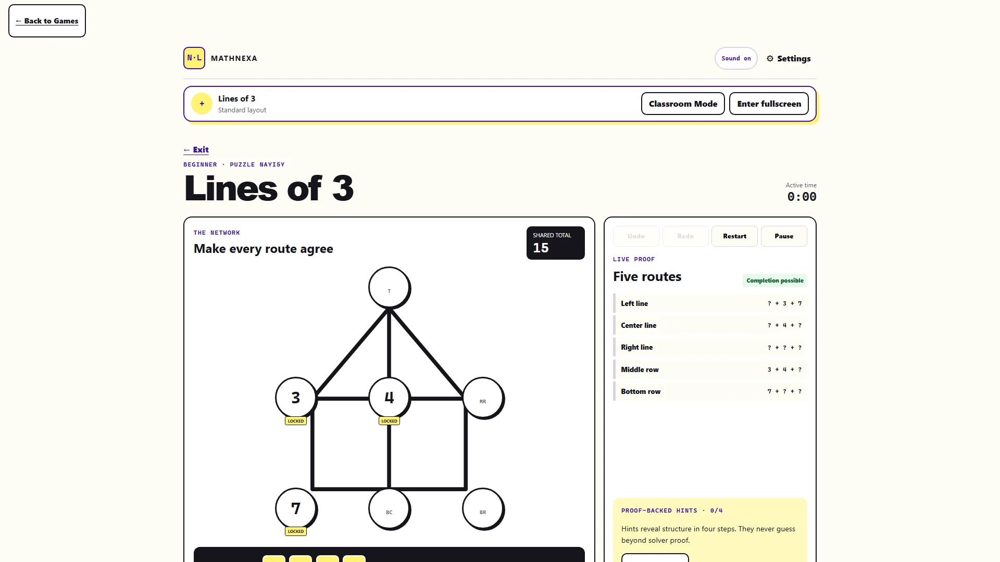 | 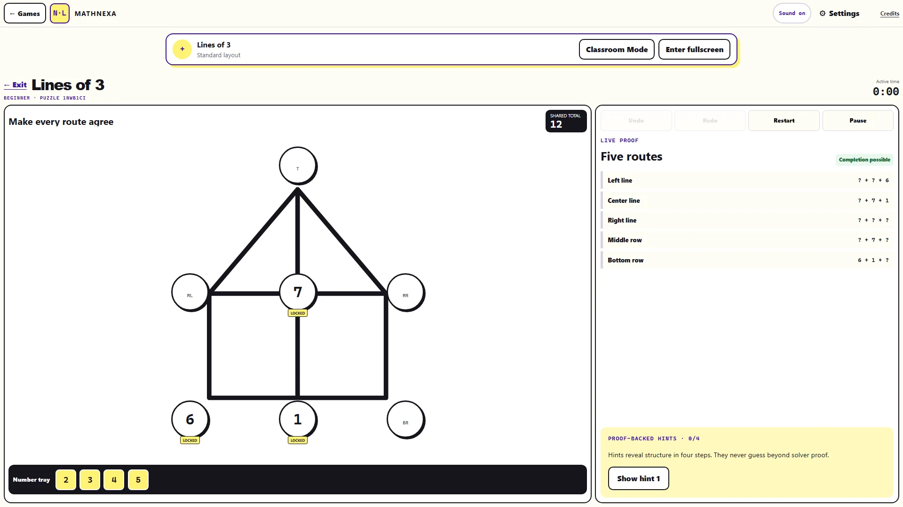 |

## 17. Production — PRODUCTION LIVE, OWNER FINAL CHECK PENDING

### 17.1 Owner staging result (2026-09-18, real phone): PASS

- Math Vocabulary Hunt: full grid visible and usable, bottom rows reachable, lower-row words selectable, the page does not scroll.
- CrossCalc: the active equation stays visible, the board is usable, tiles stay visible, no precision page scrolling, internal board scrolling acceptable for tall networks, portrait and landscape both work.
- Number Cross: board and controls fit, tutorial Skip works, no awkward page scrolling.
- Number Logic: board and controls fit, Undo / Redo / Restart / Pause reachable, Settings works, no awkward page scrolling.
- The Number Logic +16 ms difficulty-to-playable cost (§11) is accepted as a V1 tradeoff and is not to be reopened in this release.

### 17.2 Certification on the exact runtime (before the candidate)

| Gate | Result |
| --- | --- |
| typecheck / lint | pass / 0 errors |
| platform-core / platform-web unit | 245 / 245; 598 passed, 1 skipped (committed LF bytes) |
| CrossCalc V2 incl. 2,500 generated puzzles / V2 native / V1 native | 20 / 20; 7 / 9 (the 2 environment-bound provenance tests, §12); 5 / 5 |
| Number Cross / native; Number Logic / native | 24 / 24, 5 / 5; 24 / 24, 7 / 7 |
| Content, media, Pages redirect, security (279 + bundle and launch audits), Number Logic integration audit, production build | pass |
| MVH atomic delivery / real runtime / audio / session / canonical | 3 / 3 + 9 / 9; 40 / 40; 8 / 8; 4 / 4; 9 / 9 |
| Mobile gameplay contract | 151 passed, 0 failed, 41 skipped by design |
| CrossCalc, every difficulty × 9 profiles (phones, landscape, tablets, desktop, Smart Board) | 45 / 45 — page scroll 0, Solving line, tiles and Hint / Check on screen and uncovered, only the board frame scrolls, targets ≥ 44 px |
| Number Logic, 6 modes × 5 profiles + Settings | 30 / 30 |
| Number Logic difficulty → playable (normal CPU) | 33 → 48 / 49 ms, no further regression |
| gzip added (committed LF bytes) | MVH +4.19 KB, CrossCalc +4.49 KB, Number Cross +1.88 KB, Number Logic +3.02 KB; no library added |

### 17.3 Candidate identity

- **`dpl_FNf6c8Zv8VsCefNW1EaLZ3uQiFoJ`** (`mathnexa-platform-production-9tl3wtky5-…`), built 2026-09-18 06:24:57 CDT from a pristine LF checkout of `c860a28` (tree `89f9fa35…`) with `vercel deploy . --project mathnexa-platform-production --prod --skip-domain --env MVH_SOURCE_REVISION=c860a28…` (deployment-scoped, no project environment change, no domains assigned). The CLI uploaded no files at all: every source file already existed in Vercel's content store from the staging upload of the same tree.
- **Source, per Vercel's own file listing** (`/v6/deployments/:id/files`): 1,640 `src` files, every one SHA-1-identical to `c860a28` (the three `.gitignore` files are never uploaded) and identical to the staging deployment `dpl_ApV1224N1gknHqn6xPVofs5MS3PF` (0 of 1,640 differ). The 220 `out/` build entries differ from staging, as expected for two environments. Server-side files by SHA-1 — the Math Vocabulary Hunt enhancer, the CrossCalc V2 and Number Logic document renderers, `next.config.mjs`, `lib/security/headers.mjs`, `lib/games/internal-registry.ts`, `docs/index.html` — identical to `c860a28`.
- **Served bytes** (through Deployment Protection with `vercel curl`): all 23 game code files — the 5 changed in this phase and the 18 protected bundles and engines — byte-identical to `c860a28`; the 18 are also identical to production runtime `80a509c`. Candidate health: `ready · production-platform · build c860a288… · payments live`.
- **Line endings.** The previous production deployment served four `game-suite` text files with CRLF (it had been uploaded from a CRLF checkout). The candidate serves the committed LF bytes; content is identical after stripping CR. No normalization was needed to compare the candidate with `c860a28`.

### 17.4 CSP parity work is not in this release

`27dd1eb` (`fix/local-internal-game-csp-parity`) is not an ancestor of `c860a28` or of this branch. The candidate's `next.config.mjs`, `headers.mjs` and `internal-registry.ts` are the `c860a28` versions (SHA-1 differs from `27dd1eb`'s), and `internal-game-headers.mjs` is not in the upload. Live, the game routes still answer with the platform CSP, byte-identical to before promotion.

### 17.5 Promotion

| Item | Value |
| --- | --- |
| Previous production (rollback) | `dpl_AaPnXGGohzFLd3ece7eNyah2xmCF` (runtime `80a509c`), Ready, retained |
| Promoted | **`dpl_FNf6c8Zv8VsCefNW1EaLZ3uQiFoJ`** (runtime `c860a28`), exactly as certified, no rebuild |
| Command | `vercel promote dpl_FNf6c8Zv8VsCefNW1EaLZ3uQiFoJ --scope bright-path-ed-tech`, from a directory linked to `mathnexa-platform-production` |
| Time | 2026-09-19 00:33:02 → 00:33:11 UTC ("Success! … promoted … [2s]") |
| Aliases moved | `mathnexa.com`, `www.mathnexa.com` (308 → apex) and the webhook host `mathnexa-platform-production.vercel.app` — all `dpl_FNf6c8…`, Ready |
| Health | `ready · production-platform · build c860a288… · searchIndexing enabled · payments live` (three reads) |
| Rollback | `vercel promote dpl_AaPnXGGohzFLd3ece7eNyah2xmCF --scope bright-path-ed-tech` |

### 17.6 Live verification (2026-09-19)

The four game routes need a signed-in, entitled account — that is the owner's final check. Everything they deliver apart from the document itself is public, so the session verified production two ways:

1. **Live bytes:** all 541 public game files on `https://mathnexa.com` are byte-identical to `c860a28` (digest `5eddc010…`, the same as staging).
2. **Live-asset harness:** the game documents rendered by the exact `c860a28` renderers (what the production route returns), under the real route CSPs, with every other request fetched live from `https://mathnexa.com` — 3,613 requests, 3,224 × 200 and 389 × 206 (audio ranges), 0 failures.

| Check (production bytes) | Result |
| --- | --- |
| Full mobile contract: Chromium desktop, Chromium phone, WebKit phone, WebKit desktop (1440 × 900 and 1920 × 1080 in the desktop projects) | **150 passed, 1 failed, 41 skipped by design.** The failure is the Number Cross 390 × 844 visual baseline: new puzzles are seeded with `Date.now()`, and this one opened with 5 lines already solved, so its target badges differ from the baseline (layout identical). Re-run × 6 on production bytes: 6 / 6 pass. A test-determinism follow-up, not a product difference |
| Math Vocabulary Hunt, 18 × 18 | every lesson grid fits 390 × 844 with its first and last cells on screen; compact header, timer and status visible, Controls menu opens over the game; no mid-word breaks; a word through the bottom rows found by taps (Chromium and WebKit phones) and a touch drag across the last row (Chromium); no page scroll at 320 × 568, 390 × 664, 390 × 844, landscape, tablet, desktop and Smart Board |
| CrossCalc | Beginner / Easy / Medium / Hard / Expert × 9 profiles: **45 / 45**; the Solving line stays on screen while the board scrolls; a whole Easy network solved by taps on both phones; a Medium network fits 1440 × 900 and 1920 × 1080 whole |
| Number Cross | Skip is a real 44 px control at every size; first- and last-row play; no page scroll at 320 × 568, 390 × 844, 844 × 390 |
| Number Logic | 6 modes × 5 profiles + Settings: **30 / 30**; tile placement and Undo; music contracts unchanged (native suite) |
| Orientation | portrait → landscape → portrait without a reload, all four games, both phone engines |
| Desktop / Smart Board | 1440 × 900 and 1920 × 1080 pass for all four games |
| Accessibility | axe WCAG 2.1 AA and keyboard focus checks pass (Number Cross's frozen-engine findings unchanged) |
| Security headers | `/`, `/sign-in`, `/access`, `/pricing`, `/games`, the three play routes, `/game/runtime/index.html`, `/teacher`, the cron endpoint: status, Location and ten security headers byte-identical before and after promotion |
| Access / billing | payments live; product and play routes 307 → access page; the MVH runtime 401; cron 401; authorized-code form present; the webhook route answers its own 405 (`Allow: POST`) on the apex and on the webhook host, not redirected; route code unchanged |
| MAP Prep | `showme.mathnexa.com` still `dpl_B7vcLDDoRpvZAm5UZgPCfhz6u9F9` |
| Game logic | the runtime diff `80a509c..c860a28` is 8 layout files (+1 unit test); engines, bundles, generators, `lib/games`, billing, auth, access, API routes, proxy, `next.config.mjs`, security, database and canonical documents: 0 changes |

### 17.7 Carried forward

- **CrossCalc, pre-existing (reproduced on `origin/main`):** in Chromium phones, switching to Hard or Expert can leave the tile row with a non-zero horizontal `scrollLeft`, so it opens part-way along. Tiles stay visible and usable and the certified contract holds (page scroll 0, Solving line, tray, Hint / Check, board-only scrolling). Not changed in this release; a future polish item.
- **Number Cross visual baseline:** freeze the clock in that test so the puzzle is deterministic (test-only follow-up).
- **Not driven by this session:** the signed-in game routes themselves (no owner credentials) — the owner's final production check.
- `main`: not merged. Tag: none.
