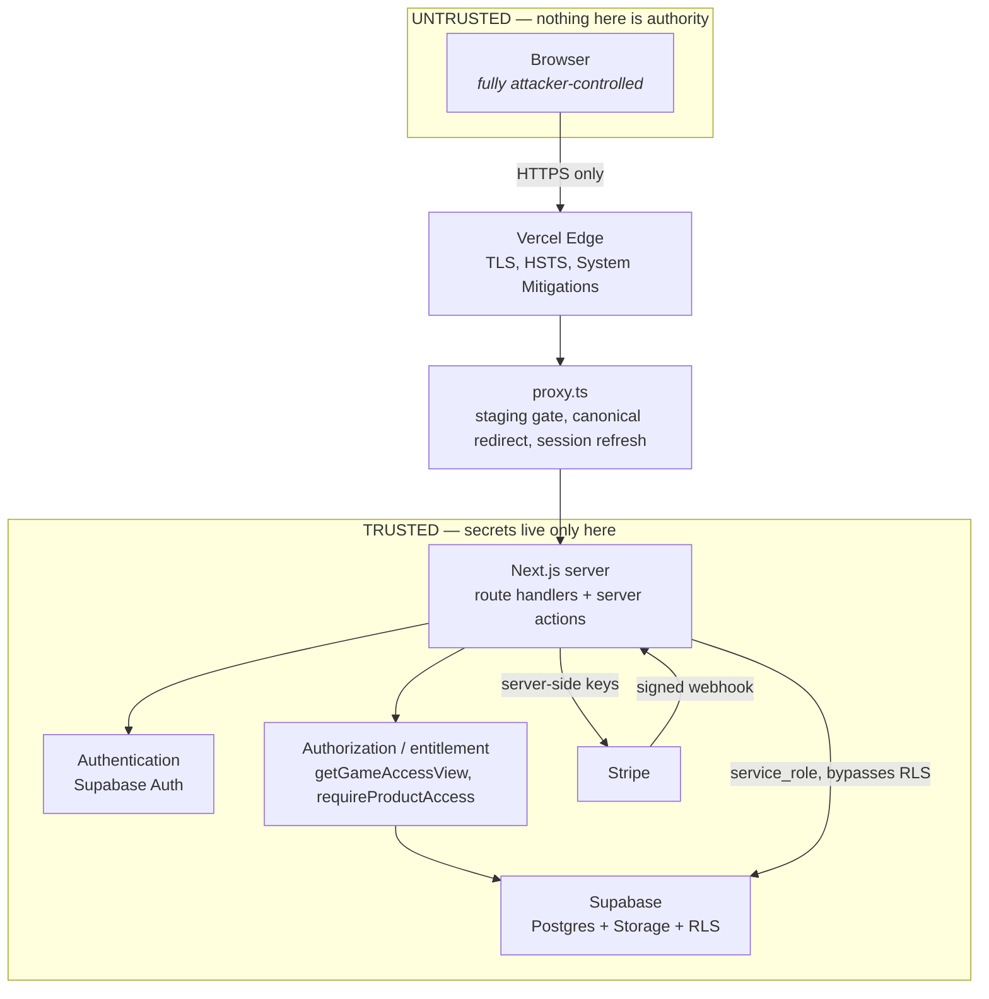

# MathNexa Security Architecture

Current as of the overnight hardening branch, which descends from the frozen
production release `v1.2.4` (`7c01ff2`).

This describes where authority actually lives, so that a future change can be
judged against it rather than against an assumption.

## Request path and trust boundaries

The single most important line in that diagram is the one between the browser
and everything else. **Nothing the browser sends is authority**: not a cookie
value, not a query parameter, not a form field, not a header, not local storage.
Every security decision is taken on the server from state the server owns.

## Where authority lives

| Decision | Decided by | Never decided by |
|---|---|---|
| Is this person signed in? | Supabase Auth, verified server-side with `getUser()` | a cookie the client can edit |
| Is this person entitled to a product? | `getGameAccessView()` reading entitlement evidence from Postgres | a query parameter, `localStorage`, or a client flag |
| Is this an admin? | `decideAdminAccess()` — admin record + `aal2` MFA + a bound server-side session | a role claim the client supplies |
| Is this authorized-code access? | HMAC comparison against a server-only code, then a signed session cookie | the code being present in any client artifact |
| Is this a valid game asset request? | An HMAC-signed, audience-bound, 5-minute ticket | the asset path alone |
| Is this webhook genuine? | Stripe signature verification against a server-only secret | the request claiming to be Stripe |
| Is staging locked? | `stagingAccessRequirement()` over server-only environment values | anything in the request |

## Secret boundary

Secrets exist only in the Vercel server environment and are reachable only from
modules marked `import "server-only"`. The browser receives exactly two
configuration values, both intended to be public:
`NEXT_PUBLIC_SUPABASE_URL` and `NEXT_PUBLIC_SUPABASE_PUBLISHABLE_KEY`.

This is verified rather than asserted: a standing scan of the built client bundle
checks 19 secret patterns and 19 privileged server symbols and requires zero hits
for all of them. The production bundle has been scanned in every phase and has
never carried a secret, the entitlement decision, the admin model, or the
authorized code.

## The four internal boundaries

**Admin.** The strongest boundary in the product. Reaching it needs a Supabase
session, an `admin_users` record that is not revoked, enrolled MFA at assurance
level `aal2`, a server-side session bound to that admin and hashed in the
database, and an HMAC CSRF token on every mutation. All 35 admin routes enforce
it and answer a non-authorized caller with a concealment `404`. Admin actions
write to `admin_audit_log`.

**Billing.** The client can start a checkout but cannot influence what is
charged: product and price identifiers come from server configuration. Entitlement
is written only by a signature-verified webhook, with idempotency receipts and
replay refusal. The browser has no path to marking itself subscribed.

**Staging.** A gate evaluated before any environment-mode branch in `proxy.ts`,
locking the entire site behind a signed `__Host-` cookie obtained with a bearer
token. Its configuration is normalized once at a single boundary so transport
whitespace cannot silently disable it.

**Game runtime.** Delivered same-origin inside a sandboxed iframe, behind an
HMAC-signed ticket bound to both the package and the principal. This is why the
CSP uses `frame-ancestors 'self'` rather than `'none'`.

## Rate limiting

Three dimensions, all over one already-deployed Postgres function, all keyed on
material the caller cannot choose:

| Dimension | Keyed on | Budget | Enforced |
|---|---|---|---|
| Request | account + platform-set address | 20 / 15 min (sign-in) | yes |
| Account target | account only | 20 / 15 min | yes, sign-in only |
| Spray observation | address only | 20 / 15 min | **no** — signal only |

The account dimension exists because the request dimension alone falls to a proxy
pool. The spray dimension is not enforced because a class of thirty behind one
school address can legitimately exceed any budget the function can express.

## Failure modes

| Dependency | If unavailable | Rationale |
|---|---|---|
| Rate-limiter RPC | **Fail closed** in production-platform; allow elsewhere | Its preconditions are a subset of the auth client's, so a production state where it is missing is already one where sign-in fails |
| Supabase Auth | Sign-in unavailable | It *is* authentication |
| Supabase service client | Entitlement defaults to deny; downloads 503 | Never fail open on paid access |
| Stripe | Checkout unavailable; existing entitlement unaffected | Entitlement is read from our own database |
| Security event sink | Event dropped silently | Detection must never become an availability failure |
| Staging gate config | **Fail closed** where a gate token is present | A misconfigured gate must not serve the site |

## Known deliberate trade-offs

These look like gaps and are not. Each is recorded so nobody "fixes" one into a
regression.

- **`frame-ancestors 'self'`, not `'none'`** — the game runtime is framed
  same-origin.
- **`form-action` permits two Stripe hosts** — checkout and the billing portal
  are form posts that redirect off-site, and Firefox enforces `form-action`
  against the redirect target.
- **`script-src 'unsafe-inline'`** — see `csp-nonce-feasibility.md`.
- **The rate-limiter secret floor is 20 characters** — it matches
  `hasProductionIdentityConfiguration()`; raising it would lock customers out.
- **Spray detection does not enforce** — school NAT.
- **The account limiter's window equals its block** — a longer window makes an
  attacker-controlled lockout indefinite.
